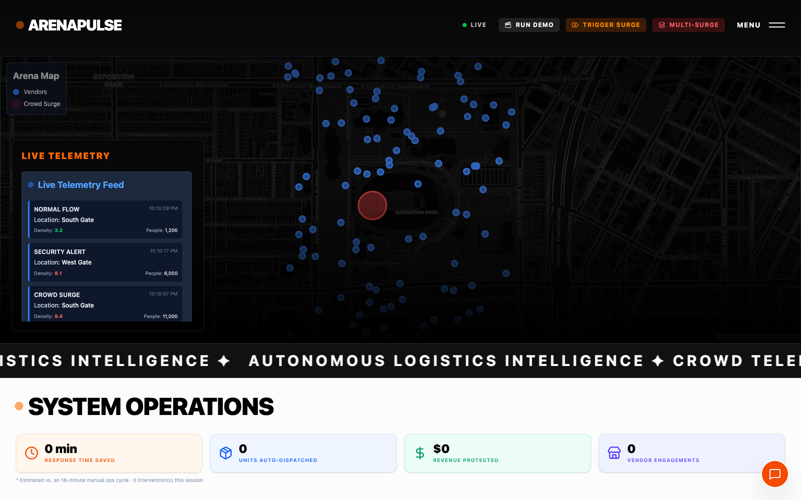

# ArenaPulse ✦ Autonomous World Cup Crowd & Commerce Coordinator



ArenaPulse is an **autonomous multi-agent system** for large-scale events (FIFA World Cup 2026). It doesn't answer questions — it **takes action**: a live stream of crowd telemetry triggers an agent that reasons about surge risk, checks vendor supply, verifies feasibility, and autonomously dispatches resources and hyper-local flash deals — all streamed to a live dashboard.

> Built for the **Google Cloud "Building Agents for Real-World Challenges"** hackathon — Gemini 3 brain · Google Cloud Agent Builder (ADK) · **Elastic** partner MCP track · Arize observability.
>
> 📋 Build status, phases, and the manual setup steps live in **[`HACKATHON_PLAN.md`](HACKATHON_PLAN.md)**. The product vision is in **[`project_idea.md`](project_idea.md)**.

## Agent architecture

```
  Live crowd telemetry (5 s tick)
           │
     ┌─────▼──────────┐
     │   Simulator    │  density · crowd count · zone · lat/lon
     └─────┬──────────┘
           │ pub/sub (in-memory async)
           ▼
  ╔════════════════════╗
  ║  ① Perception      ║  ML pre-filter → Gemini 3 multi-factor reasoning
  ║                    ║  → risk_level : LOW / MEDIUM / HIGH / CRITICAL
  ╚════════╤═══════════╝
           │
  ╔════════▼═══════════╗         ┌──────────────────────────────┐
  ║  ② Planning        ║────────▶│  ADK LlmAgent (google-adk)   │
  ║                    ║◀────────│  model: Gemini 3             │
  ╚════════╤═══════════╝         │  tool:  find_nearby_vendors  │◀─ Elastic MCP
           │                     └──────────────────────────────┘
           │  action · resources · target zone
           ▼
  ╔════════════════════╗
  ║  ③ Inventory       ║  allocate nearest in-stock vendors (geo-search)
  ╚════════╤═══════════╝
           │
  ╔════════▼═══════════╗
  ║  ④ Validation      ║  resource-sufficiency check → VALID / INVALID
  ╚════════╤═══════════╝
           │
  ╔════════▼═══════════╗  feasible?
  ║  ⑤ Verification    ║──── NO ──▶ inject correction → re-run ②③④
  ║   (RAG loop)       ║            max 2 self-correction replans
  ╚════════╤═══════════╝
           │ YES
    high-impact?
           │ YES
     ┌─────▼────────────┐
     │  ⑥ Human Gate    │  POST /api/v1/approvals/{event_id}
     │  Approve/Reject  │  ApprovalQueue panel (live dashboard)
     └─────┬────────────┘
           │ approved (or auto if low-impact)
           ▼
  ╔════════════════════╗
  ║  ⑦ Execution       ║  dispatch resources · B2B restock orders (PO-xxxx)
  ╚════════╤═══════════╝
           │
  ╔════════▼═══════════╗
  ║  ⑧ Marketing       ║  Gemini drafts hyper-local flash deal
  ║                    ║  zone · item · vendor · 30-min window
  ╚════════╤═══════════╝
           │ WebSocket  /api/v1/ws/dashboard
           ▼
  ┌─────────────────────────────────────────────────────────────┐
  │  Live Dashboard  (React 19 · Vite · Tailwind v4 · Zustand)  │
  │  Leaflet map · AgentPanel · ApprovalQueue                   │
  │  CampaignsPanel (flash deals) · RestockPanel (restock POs)  │
  └─────────────────────────────────────────────────────────────┘
```

| Hackathon pillar | Where it lives |
|---|---|
| **Gemini 3** (google-genai) | Perception (risk reasoning), Planning (decision), Marketing (flash deal copy), LLM-judge plan eval, semantic embeddings |
| **Google ADK** (google-adk) | `adk_agent.py` — real `LlmAgent` that autonomously calls the Elastic tool |
| **Elastic MCP** (partner track) | `find_nearby_vendors` FunctionTool; hybrid BM25+kNN RAG retrieval; agent decision memory; live ES\|QL analytics |
| **Arize Phoenix** | OpenTelemetry traces of every Gemini + MCP call, plus `plan_eval` spans (LLM-judge score per intervention) |

### Beyond the pipeline

- **Agent decision memory** — every planning decision is indexed in Elasticsearch (`agent_decisions`); on the next event in the same zone the agent recalls its recent decisions and reasons with experience. A self-improving loop, entirely on Elastic.
- **Hybrid semantic RAG** — supply-chain constraints carry Gemini embeddings (`dense_vector`, 768 dims); verification retrieves them with a combined BM25 + kNN query, falling back to BM25 and then to an in-memory corpus.
- **LLM-judge evaluation** — after each executed plan, a Gemini judge scores it 1–10; the score lands as an OTel span attribute in Arize Phoenix *and* as a ⚖ badge on the dashboard's event timeline.
- **Counterfactual display** — when RAG verification rejects a plan, the dashboard shows the rejected vs corrected plan side by side with the blocking constraint between them.
- **Live ES|QL analytics** — every chart on the Global Analytics page runs a real ES|QL query (`STATS … BY` aggregations over live indices); each chart shows the exact query behind it.
- **Multi-surge concurrency** — one click fires 3 simultaneous zone surges; pipelines run in parallel and compete for the same vendor stock.
- **Impact metrics** — each dispatch estimates response-time saved, units dispatched, and revenue protected; cumulative totals on the dashboard.

### Graceful degradation (design principle — preserve it)
Runs with **nothing external configured**: mock Redis always; Elastic, Gemini, and the trained ML model are all optional with built-in fallbacks. Credentials simply upgrade the system from "fallback" to "full".

## Run locally

```bash
# Frontend
cd frontend && npm install && npm run dev      # http://localhost:5173

# Backend
cd backend && python -m venv venv && source venv/bin/activate   # Windows: venv\Scripts\activate
pip install -r requirements.txt
cp .env.example .env                           # optional: add Gemini / Elastic creds
uvicorn app.main:app --reload                  # http://localhost:8000

# Tests
cd backend && pytest
```

## Layout
```
backend/app/    simulator, agents, llm (gemini), infra (pubsub/mock_redis), ml, elastic, mcp, routers, observability
frontend/src/   pages/, components/, store/
models/         trained surge_predictor.joblib
```

See [`CLAUDE.md`](CLAUDE.md) for architecture details. Licensed under [MIT](LICENSE).
