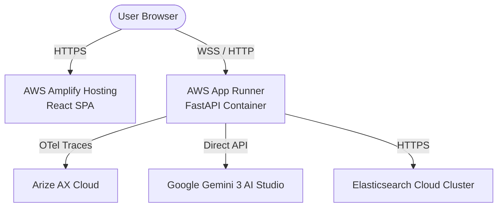

# AWS Deployment Guide - ArenaPulse

This guide outlines the steps to deploy the ArenaPulse monorepo to AWS, ensuring the React/Vite frontend, FastAPI backend, WebSockets, and database integrations are configured correctly.

---

## 🏗️ Architecture Overview

The recommended and simplest serverless deployment architecture on AWS is:



1. **Frontend**: **AWS Amplify Hosting** (automatic build/deploy from Git, SSL, custom domain, and SPA redirects).
2. **Backend**: **AWS App Runner** (fully managed container runner, similar to Google Cloud Run, scales to zero/low, supports persistent WebSockets, SSL included).
3. **Database / Integrations**: Kept as-is (remote Elastic Cloud cluster, Gemini AI Studio API, Arize Phoenix trace collector).

---

## 👤 Prerequisites

Before deploying, make sure you have:
1. An **AWS Account** with administrative permissions.
2. A **GitHub Repository** containing the ArenaPulse project (accessible by AWS Amplify and App Runner).
3. Active API keys from **Gemini AI Studio**, **Elastic Cloud**, and **Arize Phoenix** (copy these from your local backend/.env).

---

## 1. 🚀 Backend Deployment (AWS App Runner)

AWS App Runner is the recommended service for containerized applications like our FastAPI backend. It reads our `backend/Dockerfile` and spins up the environment automatically.

### Step-by-Step Configuration:
1. Open the **AWS App Runner Console**.
2. Click **Create service**.
3. Under **Source**:
   - Select **Source code repository**.
   - Connect your GitHub account and choose the `arena-plus` repository.
   - Set the branch to `testing` (or your preferred branch).
   - Under **Deployment trigger**, select **Automatic** (so commits automatically redeploy).
   - Click **Next**.
4. Under **Configure build**:
   - Select **Use configuration file** OR **Configure all settings here**.
   - Select **Configure all settings here**:
     - **Runtime**: `Python 3` OR **`Docker`** (Select **`Docker`** since we have a custom `Dockerfile` in `backend/`).
     - **Port**: `8000` (This matches our Dockerfile default `PORT` and `EXPOSE` settings).
     - **Build command**: Leave blank (not required for Docker runtime).
     - **Start command**: Leave blank (App Runner runs the Docker entrypoint).
     - Click **Next**.
5. Under **Configure service**:
   - **Service name**: `arenapulse-backend`.
   - **Virtual CPU & Memory**: `1 vCPU & 2 GB Memory` (sufficient for our agent tasks).
   - **Environment variables**: Add the following keys from your `.env`:
     - `GOOGLE_GENAI_USE_VERTEXAI` = `false`
     - `GEMINI_API_KEY` = `your-gemini-api-key`
     - `GEMINI_MODEL` = `gemini-3.1-flash-lite`
     - `ELASTICSEARCH_URL` = `your-elasticsearch-url`
     - `ELASTIC_API_KEY` = `your-elastic-api-key`
     - `PHOENIX_COLLECTOR_ENDPOINT` = `your-arize-phoenix-collector-endpoint`
     - `PHOENIX_API_KEY` = `your-arize-phoenix-api-key`
     - `SIMULATION_ACTIVE` = `false` (highly recommended for production to prevent quota consumption)
     - `DRY_RUN` = `true` (or `false` if you want dispatches to execute live)
     - `USE_ADK` = `true`
     - `APPROVAL_REQUIRED` = `false`
6. Under **Networking**:
   - Ensure the service is **Publicly accessible** so the frontend can reach the WebSocket and API endpoints.
7. Click **Next**, review the service details, and click **Create & deploy**.
8. **Save the Service URL**: Once the service completes deployment, it will give you a default HTTPS URL (e.g. `https://xxxxxx.us-east-1.awsapprunner.com`). **Copy this URL.**

---

## 2. 🌐 Frontend Deployment (AWS Amplify)

AWS Amplify Hosting provides Git-integrated static page hosting, optimal for Vite single-page applications.

### Step-by-Step Configuration:
1. Open the **AWS Amplify Console**.
2. Click **Create new app** (or **Host web app**).
3. Connect your GitHub account, select the `arena-plus` repository, and the `testing` branch. Click **Next**.
4. Under **App build settings**:
   - Amplify will automatically detect the Vite React app inside `frontend/`.
   - Update the **Build settings YAML** to ensure it builds from the `frontend/` subdirectory:
     ```yaml
     version: 1
     frontend:
       phases:
         preBuild:
           commands:
             - cd frontend
             - npm ci
         build:
           commands:
             - npm run build
       artifacts:
         baseDirectory: frontend/dist
         files:
           - '**/*'
       cache:
         paths:
           - frontend/node_modules/**/*
     ```
5. Under **Environment variables**:
   - Add a variable: `VITE_API_BASE`
   - Set its value to the **AWS App Runner Service URL** you saved in Step 1 (e.g. `https://xxxxxx.us-east-1.awsapprunner.com`).
6. Click **Next** and click **Save and deploy**.
7. **Configure Rewrite Rules (Crucial for Single-Page Apps)**:
   - Go to **Amplify Console** -> **App settings** -> **Rewrites and redirects**.
   - Click **Edit** and add a rewrite rule so that router navigation requests are redirected to `index.html` (preventing 404s on page refresh):
     - **Source address**: `</^[^.]+$|\.(?!(css|gif|ico|jpg|js|png|txt|svg|woff|woff2|ttf|map|json)$)([^.]+$)/>`
     - **Target address**: `/index.html`
     - **Type**: `200 (Rewrite)`
   - Click **Save**.

---

## 3. 🧪 Smoke-Testing the AWS Deployment

Once both Amplify (frontend) and App Runner (backend) are deployed:
1. Open the **Amplify app URL** (e.g. `https://main.xxxxxx.amplifyapp.com`).
2. Verify that the landing page renders.
3. Open your browser DevTools (F12) and inspect the **Network** tab or console. Ensure that:
   - API requests are going to the App Runner URL (e.g. `/api/v1/zones`).
   - The WebSocket connection is established successfully (WS protocol resolves automatically to `wss://xxxxxx.us-east-1.awsapprunner.com/api/v1/ws/dashboard`).
4. Go to `/dashboard` on the frontend, click **Run Demo**, and confirm that the agent planning events stream onto your timeline.
