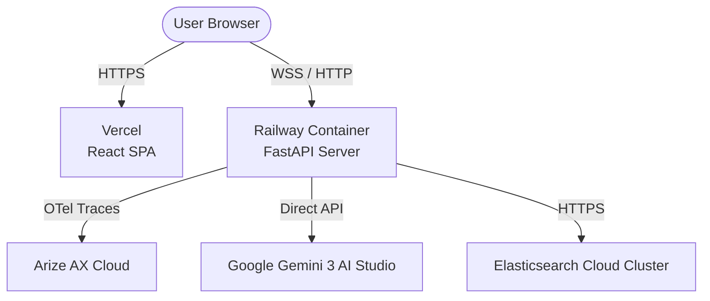

# Vercel & Railway Deployment Guide - ArenaPulse

This guide outlines the steps to deploy the ArenaPulse React frontend to **Vercel** and the FastAPI backend to **Railway**. This is the recommended serverless/PaaS combo for fast deployments, full WebSocket support, and persistent background tasks.

---

## 🏗️ Architecture Overview

1. **Frontend**: **Vercel** (Hobby/Free tier) — hosts static Vite assets and handles routing redirects.
2. **Backend**: **Railway** (Developer/Free tier) — hosts the long-running FastAPI Python container, keeping background loops and WebSockets alive.

---

## 1. 🚀 Backend Deployment (Railway)

Railway automatically detects our `backend/Dockerfile` and deploys it as a persistent server.

### Step-by-Step Instructions:
1. Go to **[Railway.app](https://railway.app/)** and sign up/log in using your GitHub account.
2. Click **New Project** (or **+ New**).
3. Select **Deploy from GitHub repository**.
4. Choose your `arena-plus` repository.
5. Click **Configure** (do not click deploy immediately):
   - Under **Root Directory**, set it to **`backend`** (this tells Railway to build inside the `backend/` folder).
   - Under **Build Source**, it will automatically detect the `Dockerfile` inside `backend/`.
6. Click **Deploy**.
7. Once the initial build starts, go to the service settings (**Variables** tab):
   - Add the following **Environment Variables** (copied from your backend/.env):
     - `PORT` = `8000` (Matches the Dockerfile expose port)
     - `GOOGLE_GENAI_USE_VERTEXAI` = `false`
     - `GEMINI_API_KEY` = `your-gemini-api-key`
     - `GEMINI_MODEL` = `gemini-3.1-flash-lite`
     - `ELASTICSEARCH_URL` = `your-elasticsearch-url`
     - `ELASTIC_API_KEY` = `your-elastic-api-key`
     - `PHOENIX_COLLECTOR_ENDPOINT` = `your-arize-phoenix-collector-endpoint`
     - `PHOENIX_API_KEY` = `your-arize-phoenix-api-key`
     - `SIMULATION_ACTIVE` = `false` (highly recommended to disable automated telemetry loops in production to prevent credit burn)
     - `DRY_RUN` = `true` (or `false` to modify Elasticsearch records live)
     - `USE_ADK` = `true`
     - `APPROVAL_REQUIRED` = `false`
8. Go to the service settings (**Settings** tab):
   - Scroll down to **Networking**.
   - Click **Generate Domain** to create a public HTTPS URL (e.g. `https://backend-production-xxxx.up.railway.app`).
   - **Copy this generated domain URL**.

---

## 2. 🌐 Frontend Deployment (Vercel)

Vercel hosts Vite static pages and uses vercel.json to handle single-page app redirects.

### Step-by-Step Instructions:
1. Go to **[Vercel.com](https://vercel.com/)** and log in using your GitHub account.
2. Click **Add New...** -> **Project**.
3. Import your `arena-plus` repository.
4. Configure the Project Settings:
   - **Framework Preset**: Select **`Vite`** (it should auto-detect).
   - **Root Directory**: Select **`frontend`** (click Edit, select the `frontend` folder, and click Continue).
   - Expand the **Build and Development Settings** section; confirm they are:
     - Build Command: `npm run build`
     - Output Directory: `dist`
     - Install Command: `npm install`
5. Expand the **Environment Variables** section:
   - Add a key: **`VITE_API_BASE`**
   - Set its value to the **Railway Public HTTPS URL** you generated in Step 1 (e.g. `https://backend-production-xxxx.up.railway.app`).
6. Click **Deploy**.
7. Once the deploy completes, open the Vercel App URL (e.g. `https://arena-plus-frontend.vercel.app`).

---

## 3. 🧪 Testing and Verification

- The frontend automatically swaps `https://` to `wss://` for WebSocket endpoints. Check your browser's DevTools console (F12) to verify the WebSocket connection to Railway:
  - `wss://backend-production-xxxx.up.railway.app/api/v1/ws/dashboard`
- Go to `/dashboard` and trigger a surge or click **Run Demo** to verify the end-to-end telemetry cascade streams live via WebSockets.
